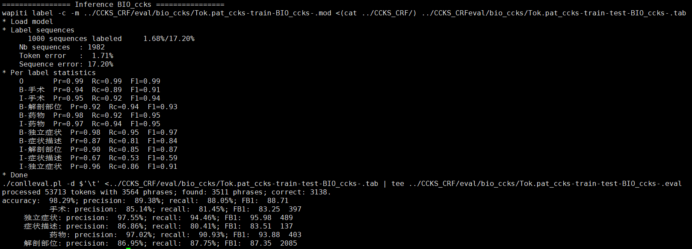

## 运行流程：
#### @Author zhoukaiyin
#### 任务描述
本评测任务为面向中文电子病历的命名实体识别，即对于给定的一组电子病历纯文本文档，任务的目标是识别并抽取出与医学临床相关的实体提及（entity mention），并将它们归类到预先定义好的类别（pre-defined categories），比如症状，药品，手术等。

### 第一步：数据处理(Linux)

##### $python raw2bio.py -1        #将训练数据分词并贴上字典特征
##### $python raw2bio.py -2        #将标签数据分词并贴上标签
##### $python raw2bio.py -3        #将标签保存成pickle文件为了后面将训练数据与标签合在一起
##### $python raw2bio.py -4        #将标签与训练数据文本接起来构成如下格式
##### $python raw2bio.py -1 test   #将测试数据处理成需要的格式

### 第二部：模型训练(Linux)

##### $bash wapiti_ccks.sh    #训练模型，模型储存在/eval/bio_ccks中

(on validation set)

### 第三部分：获得结果(Linux)

##### $python get_result.py        #提取结果文件，结果保存在CCKS_result中其格式为BIO和finall中格式为官方标签格式
##### $python onefile.py           #将结果转成提交格式

### 结果文件
Flyon\CCKS_CRF\eval\result.txt

##### Wapiti is a simple and fast discriminative sequence labeling toolkit ( http://wapiti.limsi.fr )。A little same as CRF++

